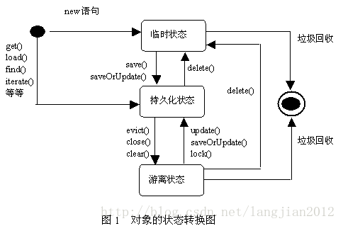

1.    映射文件配置预定义sql  qurey   sql-query

2.    加载映射文件两种方式

3.    连接池hibnate自带有一个  使用c3p0 连接池核心配置中加入c3p0 配置

4.    session   维护了hibnate 的一级缓存   通过session进行查询8个方法

5.    Transaction  事务   没有开Transaction  没有设置自动提交

6.    Query 简单查询, 条件查询  分页查询

7.    Criteria 条件查询 简单查询,条件查询 分页查询

8.    HIbnate中的持久化类   实体类+映射文件  类的编写规则
      1. 无参数构造
      2. 属性提供set/get方法
      3. 属性尽量使用包装类
      4. 类不要使用final
      5. 提供唯一标识 Id

9.    主键生成策略
      1. increnment  HIbnate 提供的自增先查询然后在加1 然后在存
      2. identity 使用数字类型  不支持oracle 数据库
      3. sequence  序列   使用short  int long ...  应用在Oracle上
      4. uuid 适用与字符串类型主键,采用随机的字符串作为主键
      5. native 本地策略,底层数据库不同,自动的选择使用identity 还是sequence.
      6. assigned Hibnate框架不维护主键,主键有程序自动生成 
      7. foreign 主键是外来的(应用在多表一对一的关系上)

10.    映射复合主键

11.    持久化类

12.    transient临时态

        1. 持久化对象没有唯一标示OID 没有纳入Session的管理

13.    persistent

      1.   持久化对象有唯一标识OID 已经纳入到Session管理

      2.   > 结论:持久化持久态有自动更新数据库的能力,在不调用update的情况下可以自动提交数据,依赖hibernate的一级缓存

14.    detached 离线态

        1. 持久化对象有唯一标识OID 没有纳入到Session管理

15.    持久化类的转换

   

13. Hibernate的一级缓存
14. 什么是缓存
    2. 缓存的好处
    3. Hibernate分成两个基本的缓存
       1. 一级缓存
       2. 二级缓存,不是默认开启,需要进行一系列的配置
15. HIbernate 管理一级缓存
16. 一级缓存和Session的生命周期相关,Session生命周期结束,一级缓存销毁
    2. clear()/evict()/flush()/refresh()管理一级缓存.
       1. clear()清空一级缓存中的所有的对象
       2. evict(Object obj) 清空其中的一个对象
       3. flush() 刷出缓存
       4. refresh() 将快照区的数据重新覆盖了一级缓存的数据
17. 持久态的自动更新依赖与快照区,在提交事务的时候会对比一级缓存区和快照区. 不同则跟新快照去同时更新数据库,,相同则不进行处理
18. Hibernate一级缓存的刷出时机(了解)
    1. 常量
        1. ALWAYS	:每次查询的时候都会刷出,手动调用flush事务提交的时候
        2. AUTO : 默认值 ,有些查询会刷出,手动调用flush,事务提交的的时候
        3. COMMIT:  在事务提交的时候,手动调用flush的时候
        4. MANUAL:  只有在手动调用flush才会刷出
    2. 严格程度: MANUAL>COMMIT>AUTO>ALWAYS
19. 操作持久化对象的方法
    1. save()
    2. update()
        1. 更新一条记录,讲托管态对象转成持久态对象
        2. 在`<class>`标签上设置`select-before-update="true"`在更新之前先去查询.如果存在不执行更新操作
    3. saveOrUpdate方法
        1. 保存或更新一条记录
        2. 如果对象时瞬时,执行save操作,如果对象是托管的执行update操作
        3. 如果设置id数据库中没有保存的,可以在映射文件的`<id>`上设置`unsaved-velue="-1"` 执行保存操作.


-----

1. Hibernate 关联关系映射

   1. 实体之间的关系

      1. 一对一
         1. 一个用户,生成多个订单,每一个订单只能属于一个用户
         2. 建表原则
            1. 在多的一方创建一个字段,作为外键,指向一的一方的主键.
      2. 多对多
         1. 一个学生可以选择多门课程,一个课程可以被多个学生选择
         2. 建表原则
            1. 创建三张表,中间表至少有两个字段,分别作为外键指向多对多双方主键
      3. 一对一(特殊,最少)
         1. 一个公司只能有一个注册地址,一个注册地址只能被一个公式使用,(否则将两个表建到哟个表中)
         2. 建表原则
            1. 唯一外键:
               1. 一对一的双方假设是多的关系需要在多的一方创建一个字段,作为外键,指向一的一方的主键,但是在外间添加一个unique
            2. 主键对应
               1. 一对一的双方,通过主键进行关联

   2. 关系映射的标签

      1. `<many-to-one name="" column="" class="">` 

         1. name :关联对象的属性名称
         2. column:表中的外键名称
         3. class:关联对象的全路径

      2. `<set>`标签

         ```
         <set name="">关联的属性名称

         	<key column=""/> 用来描述一对多多的一方外键的名称

         	<one-to-many class=""/> 关联的全路径

         </set>
         ```

      3. `many-to-many`多对多的关系

         ```
         <set name="" table=""> name对应当前类中集合的名称  table 中间表的名称
         	<key column=""></key>  对用中间表的名称
         	<many-to-many class="" column=""></many-to-many>class 另一方的全路径  column另一方在中间表的名称
         </set>
         ```

   3. Hibernate中级联保存的效果

      1. 级联:操作当前对象的时候,关联的对象如何处理
         1. cascade="save-update"
         2. 级联方向性
         3. 保存客户的时候,选择级联订单
         4. 保存订单的时候,选择级联客户

   4. Hibernate中级联删除

      1. 在默认情况下,讲外键置为null,删除数据记录
      2. 采用级联删除,需要先查询在删除

   5. Hibernate级联的取值

      1. none:不使用级联
      2. dave-update:保存或更新的时候级联
      3. delete:删除的时候级联
      4. all:除了孤儿删除以外的所有级联
      5. delete-orphan:孤儿删除(孤子删除)
         1. 仅限与一对多,只有一对多时候,才有父子存在,认为医德一方是父亲,多的一方是子方
         2. 当一个客户与某个订单解除了关系,将外键置为null,订单没有了所属客户,相当于一个孩子没有父类,将这种记录就删除了
      6. all-delete-orphan:包含了孤儿删除的左右级联

   6. 双向外键维护

      1. 配置inverse="true" 在那一端配置,那么那一端放弃了外键的维护权
         1. 一般情况下,一的一方去放弃
      2. cascade:操作关联对象
      3. inverse:控制外键的维护