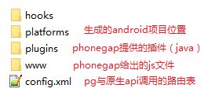
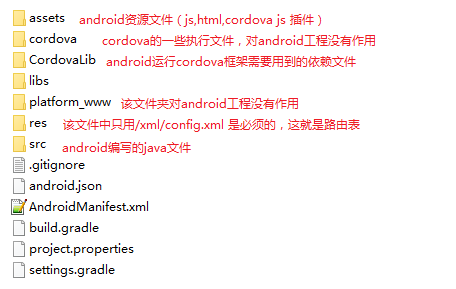
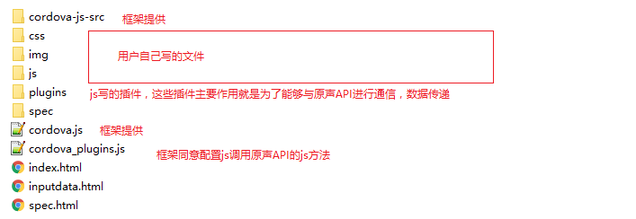
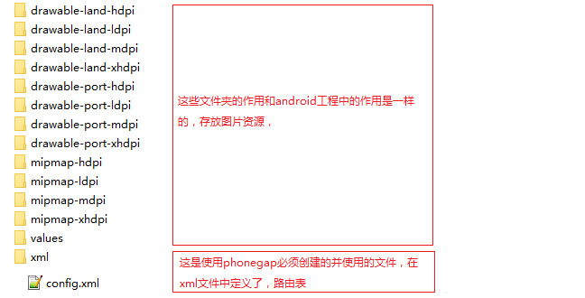
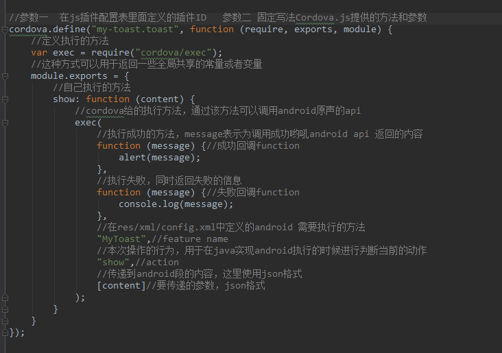
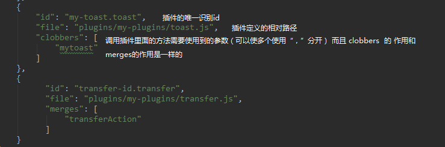
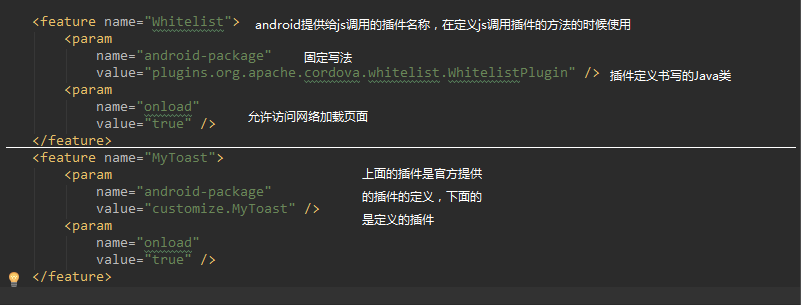

## phonegap前期准备

> cordova(phonegap) 两者区别： 

1. node.js安装
   1. 下载相应的安装跑进行安装即可

2. 安装phonegap
   1. npm install -g phonegap
   2. npm install -g cordova

3. 生成第一个应用 
   1. 创建一个cordova项目     phonegap create projectName packageName;
   2. 创建一个android工程   cordova platforms add android （等同于phonegap run android，但是执行该句会出现无法执行下去的情况。）
   3. cordova  build   编译执行android工程（这里需要连接真机或者测试机）

4. cordova项目目录结构
   1.  phonegap create xxxx   创建的文档结构

       

   2. cordova platforms add Android 创建的Android项目结构

      

   3. cordova 为js提供的js 插件 结构

      

   4. android 的创建的资源文件内容

      

5. js调用原生api 的方法定义

   1. 对于`html+css+js` 书写语法没有变化，只有在通过JS调用原生的api的时候采用特定的格式
   2. 插件的定义，建议写在`assets/www/plugins/xxx/xxx`目录下
   3. 

6. js 插件在配置

   1. JS配置文件的位置`/assets/www/cordova-plugins.js`
   2. 

7. js的调用插件里面的方法 使用`mytoast.show();`    show(); 方法是在插件里面定义的执行方法

8. Android路由表结构

   1. 路由表位置， 在Android工程中`/res/xml/config.xml`  
   2. 

9. Android中插件的书写

   1. java类需要继承CordovaPlugins 重写   

      ```java
      //按照不同的参数，重写的不同的方法进行处理不同数据
      //参数一  js传递的当前执行的行为识别码 在js插件中方法定义定义
      //参数二  传送的数据
      //参数三  执行结束以后的回调（成功/失败）会调用js中相应的方法
      execute(String action, JSONArray args, CallbackContext callbackContext) 
      execute(String action, CordovaArgs args, CallbackContext callbackContext)
      execute(String action, String rawArgs, CallbackContext callbackContext)
      ```

   2. 如果需要加载动态网络资源需要重写一下方法，

      ```java
       	@Override
          public Boolean shouldAllowRequest(String url) {
              return true;
          }
       
       	//返回为true就是能够加载网络资源，同时能够使用Cordova.js 能够与Android相互调用
       	@Override
          public Boolean shouldAllowBridgeAccess(String url) {
              return true;
          }
         
          @Override
          public Boolean shouldAllowNavigation(String url) {
              return true;
          }
      ```

      ​

10. 在activity页面中同时存在html页面和原生Android控件

  1. 在界面不居中需要使用SystemWebView的控件，该控件继承WebView

  2. Activity需要继承CordovaActivity类 

     ```java
     public abstract class BaseActivityWebView extends CordovaActivity{
       
     }
     ```

     ​

  3. 在Activity中findViewById得到该控件的实例，然后需要重写`createView` 和 `makeWebView()` 

     ```java
     	@Override
         protected void createViews() {
           	//获取SystemWebView的焦点
             appView.getView().requestFocusFromTouch();
         }

         @Override
         protected CordovaWebView makeWebView() {
             return new CordovaWebViewImpl(new SystemWebViewEngine((SystemWebView) webView));
         }
     ```

  4. 加载html页面

     ```java
     //针对CordovaActivity中WebView加载页面使用一下方法，才能和Cordova.js进行交互
     loadUrl("http://....");
     loadUrl("file://....");
     ```

     ​

11. activity调用html中js方法

    ``` java
     //使用CordovaActivity中提供的loadUrl方法直接调用。
     //参数格式 String类型  "javascript:"+js方法名字 ,  如果有参数直接拼接即可
     loadUrl("javascript:" + jsActionNmae);
    ```

    ​

    ​